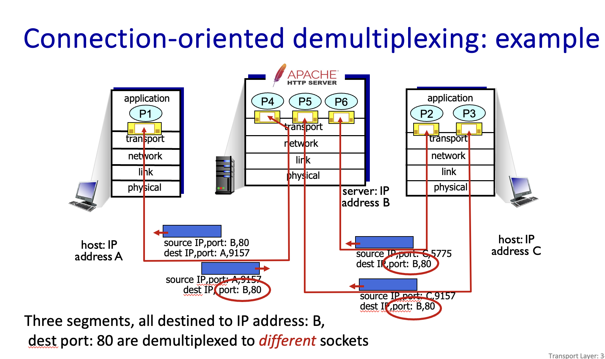
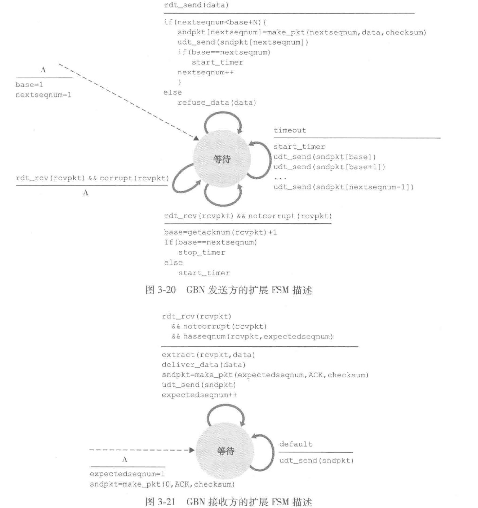
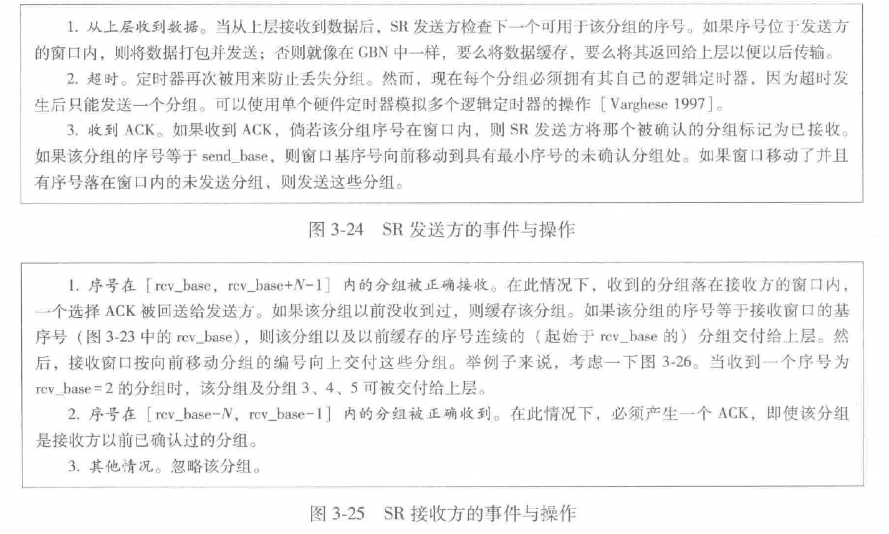
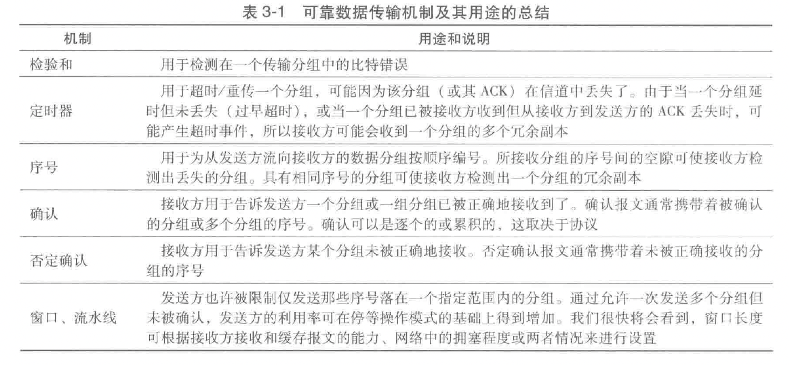
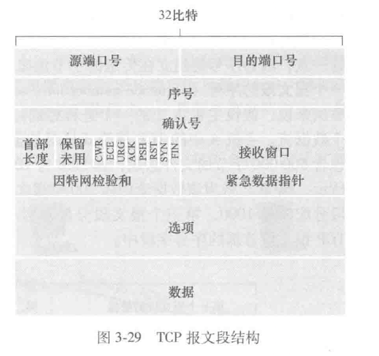
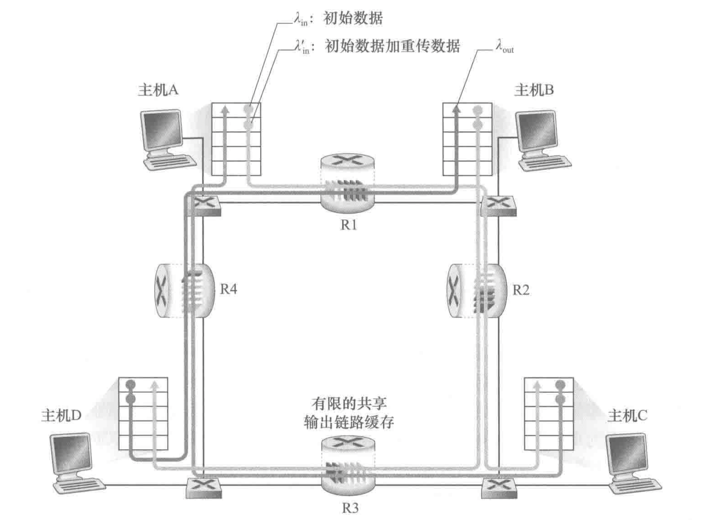
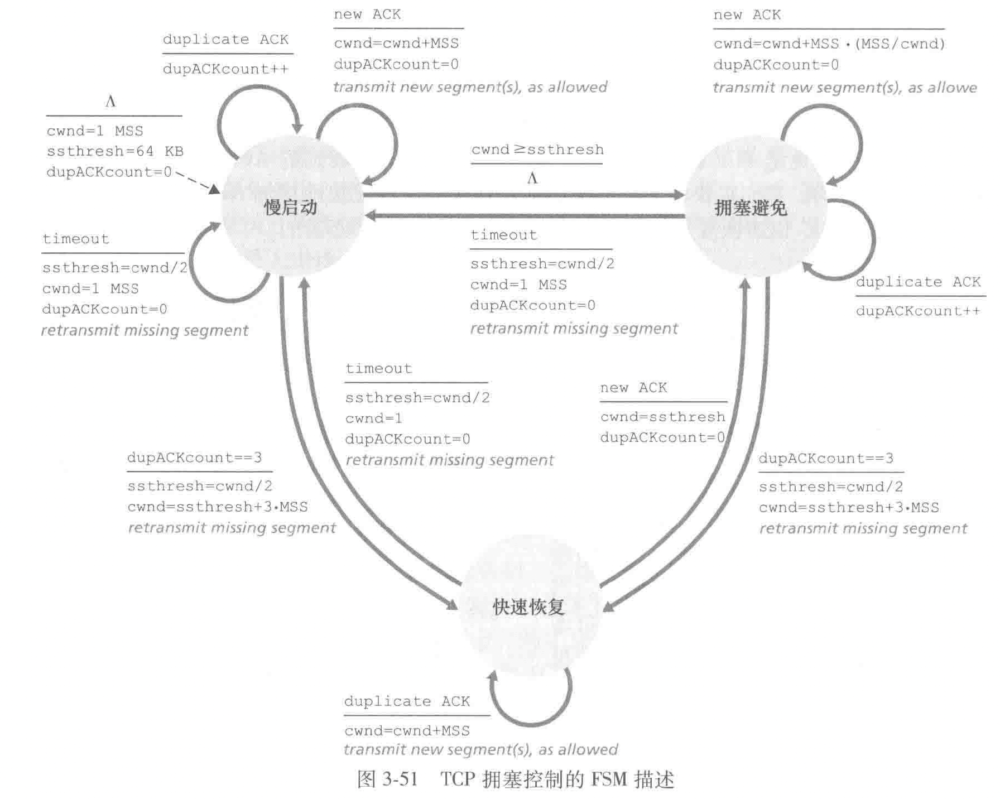
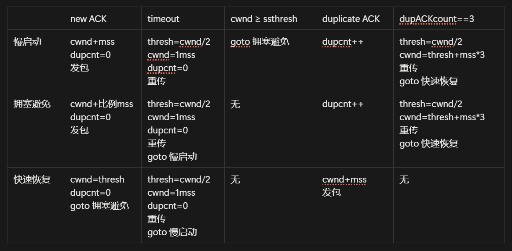

# 第三章-传输层

## Transport layer services

- 在不同 host 的 application **processes** 之间提供逻辑上的连接
- 传输层是 process 之间的，应用层是 application 之间的
- transport protocols actions in end systems:
  - sender: breaks application messages into *segments*, passes to network layer
  - receiver: reassembles segments into messages, passes to application layer
- 有两种传输层协议 TCP UDP
- **Transport vs. network layer services and protocols**
  - network layer: logical communication between *hosts*
  - transport layer*:* logical communication between *processes*
- **TCP:** Transmission Control Protocol
  - reliable, in-order delivery
  - congestion control
  - flow control
  - connection setup
- **UDP:** User Datagram Protocol
  - unreliable, unordered delivery
  - no-frills extension of “best-effort” IP
- 上面这两种都不保证
  - delay guarantees
  - bandwidth guarantees

## Multiplexing and demultiplexing（多路复用和解复用）

### **Connectionless demultiplexing**

这种情况下只需关心 source port 和 dest port，都使用目标地的同一个套接字来处理相同的 port。

### **Connection-oriented demultiplexing**

由一个四元组来区分（src ip, src port, dest ip, dest port），选用不同的套接字来处理（由四元组来区分），即一个套接字处理两个特定地址的两个特定 port 的连接.

### Summary

- Multiplexing, demultiplexing: based on segment, datagram header field values
- **UDP:** demultiplexing using destination port number (only)
- **TCP:** demultiplexing using 4-tuple: source and destination IP addresses, and port numbers
- Multiplexing/demultiplexing happen at *all* layers

## Connectionless transport: UDP(user datagram protocal)

udp segments 可能会丢失，乱序；

udp 是 connectionless 的（在发送和接收间没有牵手，每一个 udp 报文段是独立处理的）

优点：

1. 不需要建立连接（减少 rtt 延迟）
2. 简单，报文段的 header 更小
3. 没有拥堵控制（尽可能快地传输）

### UDP 报文段结构

header（8字节）

源端口号+目的端口号=32bit

长度：整个报文+header 字节数

校验和（chksum）

应用数据（报文）

### UDP 校验和

只能检测是否差错，不能差错恢复

## 可靠数据传输原理

### 构造可靠数据传输协议

rdt 1.0 → rdt 2.0 → rdt 2.1 → rdt 2.2 → rdt 3.0 有限状态机见教材/ppt

### 流水线可靠数据传输协议

定义发送方的**利用率**为发送方实际忙于将发送比特送进信道的那部分时间与发送时间之比.

1. 增加序号范围，每个分组必须有唯一的序号，可能有多个在输送中的未确认报文
2. 协议的发送方和接收方都需要缓存多个分组。发送方最低限度要缓存已发送但是还没确认的分组。接收方也可能需要那些已经正确接收的分组。
3. 所需序号范围和对缓冲的要求取决于数据传输协议如何处理丢失、损坏及延时过大的分组。差错恢复的两种基本方法是：回退 N 步（go-back-n, gbn）和选择重传（selective repeat, sr）

### GBN

gbn 接收方在收到非期望的包时，会重新发送最近按序收到的分组的ack

优点：

缓存简单，在 gbn 中，接收方不需要缓存任何失序的分组；发送方虽然需要维护窗口的上下边界以及 nextseqnum 在该窗口中的位置，但是接收方需要维护的唯一信息就是下一个按需接受的分组的序号

缺点：

存在性能问题，尤其是在窗口长度和带宽时延积都很大时

### 选择重传

接收方缓存失序的分组直到所有丢失分组（即序号更小的分组）皆被收到为止.

图 3-25 的 2 是非常重要的.

窗口长度必须小于或等于序号空间大小的一半.

## 面向连接的运输：tcp

### TCP 连接

1. 点对点（point-to-point）单个发送方与单个接收方之间的连接
2. reliable, in-order byte stream:
3. 全双工（full duplex data）：数据可以双向流动
4. 最大报文段长度（maximum segment size, mss）:1460 bytes
5. cumulative ACKs
6. 流水线
7. 面向连接的（connection-oriented）
    1. 三次握手（three-way handshake）
8. flow controlled: sender will not overwhelm receiver

### TCP 报文段

报文段=首部字段（一般为 20 字节）+数据字段（数据字段最大长度为 mss）；

发送大文件时，tcp 将文件划分成长度为 mss 的若干块

**序号和确认号（seq & ack）**：4 bytes，用来实现可靠数据传输服务

报文段的序号是该报文段首字节的**字节流编号**；

确认号：由于 tcp 是全双工的，所以发送数据的同时也会接收来自另一方的数据；*主机 A 填充进报文段的确认号是主机 A 希望从主机 B 收到的下一字节的序号（累计确认：只确定该流中至第一个丢失字节为止的字节）*

接收窗口字段：2 bytes，用于流量控制，指示接收方愿意接受的字节数量

首部长度字段：4 bit，指示了以 32 比特的字为单位的 tcp 首部长度（tcp 首部长度是可变的）

可选于变长的选项字段

标志字段：6bit；

ack 指示确认字段中的值是有效的（即该报文段包含一个对已被成功接收报文段的确认）

rst,syn,fin 用于连接建立和拆除

cwr,ece 用于拥塞通告

---

psh 比特被置位时，接收方应立即将数据交给上层

urg 指示报文段里存在着被发送端的上层实体置为“紧急”的数据；

紧急数据的最后一个字节由 2 bytes的紧急数据指针字段给出（上述三行实践中并没有使用）

### 往返时间的估计与超时

1. 估计往返时间

    tcp 会在某个时刻为一个已发送的但目前尚未确认的报文段估计一个 samplertt（相当于做一个 rtt 采样），然后按照如下公式更新 rtt:

    $$
    \text{EstimatedRTT}=(1-\alpha)\cdot\text{EstimatedRTT}+\alpha\cdot\text{SampleRTT}
    $$

    推荐值为 $\alpha=0.125$

    可以看作是一个加权平均值，对最近的样本赋予的权值要大于对就样本赋予的权值

    ??? note "RTT 偏差（DevRTT）"

        估算 SampleRTT 一般会偏离 EstimatedRTT 的程度

        beta 推荐值 0.25

        $$
        \text{DevRTT}=(1-\beta)\cdot\text{DevRTT}+\beta\cdot|\text{SampleRTT}-\text{EstimatedRTT}|
        $$

2. 设置和管理重传超时间隔

  $$
  \text{TimeoutInterval}=\text{EstimateRTT}+4\cdot\text{DevRTT}
  $$

  初始的 timeoutinterval 为 1s；同时，出现超时后， timeout… 值翻倍，以免即将被确认的后续报文段过早出现超时；然而，只要收到新的报文段并更新了估计，就用公式重新计算超时间隔

### 可靠数据传输

有两种需要记忆的方式：

1. 超时间隔加倍
2. 快速重传

    一旦收到 3 个冗余 ack，tcp 执行快速重传

### 流量控制

流量控制服务是一个速度匹配服务，即发送方的发送速率与接收方应用程序的读取速率相匹配；

tcp 通过让 **发送方** 维护一个称为“接收窗口”（receive window, rwnd）的变量来提供流量控制.

良方都各自维护一个接收窗口（指示自己还有多少可用的缓存空间）

### tcp 连接管理

三次握手与连接的关闭

## 拥塞控制原理

有三种情况，我们主要看这种情况：

在这种情况中, $\lambda_{\rm in}'$ 被称作供给载荷（offered load），我们考虑从主机 a 到 c 和从主机 b 到 d 的影响，由于 r1 的存在，从 a 发送的到 r2 的数据受链路限制被控制在 R，但是从 b 发送的数据速率是 $\lambda_{\rm in}'$，所以随着供给载荷的变大，从 a 发送的到 r2 的数据可能总是被丢弃；

每个上游路由器用于转发该分组到丢弃该分组而使用的传输容量最终被浪费掉了

tcp 使用的是一种称为“端到端拥塞控制”的方法，这种方法中，网络层**没有**为运输层拥塞控制提供支持.

## TCP 拥塞控制 - 加性增、乘性减（锯齿）

### 经典的 tcp 拥塞控制

运行在发送方的 tcp 拥塞控制机制跟踪一个额外的变量，即**拥塞窗口（congestion window）**，表示为 **cwnd**，它对一个 tcp 发送方能向网络中发送流量的速率进行了限制：

$$
\rm LastByteSent-LastByteAcked\le\min\{cwnd,rwnd\}
$$

这里不妨假设 rwnd 无限大.

“丢包事件”：超时，或收到 3 个冗余 ack；

算法包括三个部分：1. 慢启动；2. 拥塞避免；3. 快速恢复

### 慢启动

1. tcp 开始时，cwnd=mss，则传输速率大概为 mss/rtt
2. 每当传输的报文段首次被确认就增加一个 mss，这样 mss 指数增加
3. 如果存在一个由超时指示的丢包事件（拥塞）, tcp 将 cwnd 设置为 1 并重新开始慢启动；同时将第二个状态变量的值 ssthresh 设置为 cwnd/2;
4. 第二种结束方式，当检测到拥塞时 ssthresh 被设为 cwnd 的一半，当达到或超过 ssthresh 的值时，结束慢启动并且 tcp 转移到拥塞避免模式，更加谨慎地增加 cwnd
5. 最后一种结束方式，如果检测到 3 个冗余 ack，tcp 执行快速重传，进入快速恢复状态

### 拥塞控制

1. 每个 rtt 只将 cwnd 值增加一个 mss；比如无论何时收到一个新的确认，将 cwnd 增加 mss·（mss/cwnd） 字节。（比如如果 mss 时 cwnd 的 1/10，则一个 ntt 发送 10 个报文，每收到一个 ack 增加 1/10 mss 的拥塞窗口长度
2. 出现超时 tcp 的行为与慢启动时相同；
3. 如果是丢包，则进入快速恢复状态（行为见图）

### 快速恢复

1. 对于引起 TCP 进入快速恢复状态的缺失报文段，每当收到冗余的 ACK, cwnd 的值增加一个 MSS。
2. 最终，当对丢失报文段的一个 ACK 到达时，TCP 在降低 cwnd 后进入拥塞避免状态。
3. 如果出现超时事件，快速恢复在执行如同在慢启动和拥塞避免中相同的操作后，迁移到慢启动状态：cwnd 的值被设置力 1 个 MSS，并且 ssthresh 的值设置为 cwnd 值的一半。

### tcp cubic

### 对 tcp 吞吐量的宏观描述

一条连接的平均吞吐量为：0.75 W / RTT （其中 W 表示窗口的字节数，如果是 W * MSS 则表示报文段数），可以推出一个将丢包率与可用带宽联系起来的表达式：

$$
\frac{3}{4}\cdot\frac{W\cdot{\rm MSS}}{\rm RTT}=\frac{1.22\cdot{\rm MSS}}{{\rm RTT}\sqrt L}
$$

L 表示丢包率，大概有 $L=\frac{1}{3/8 W^2}$

problem p47.
