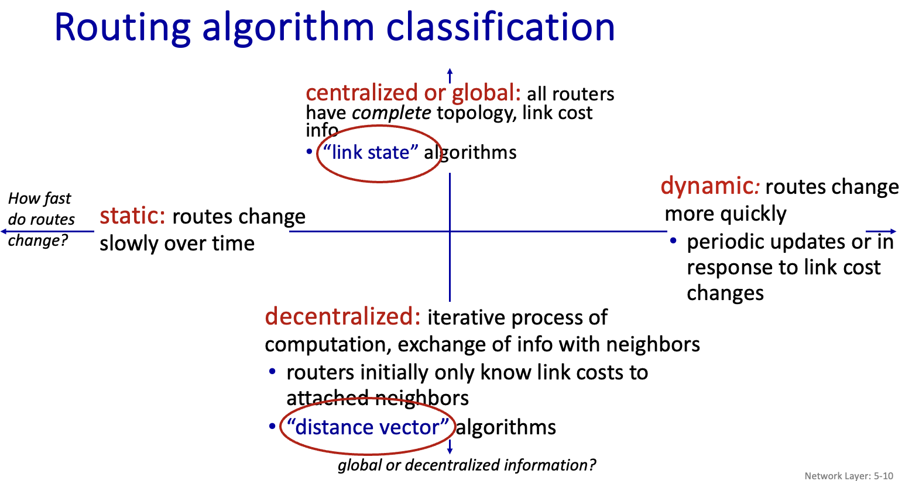
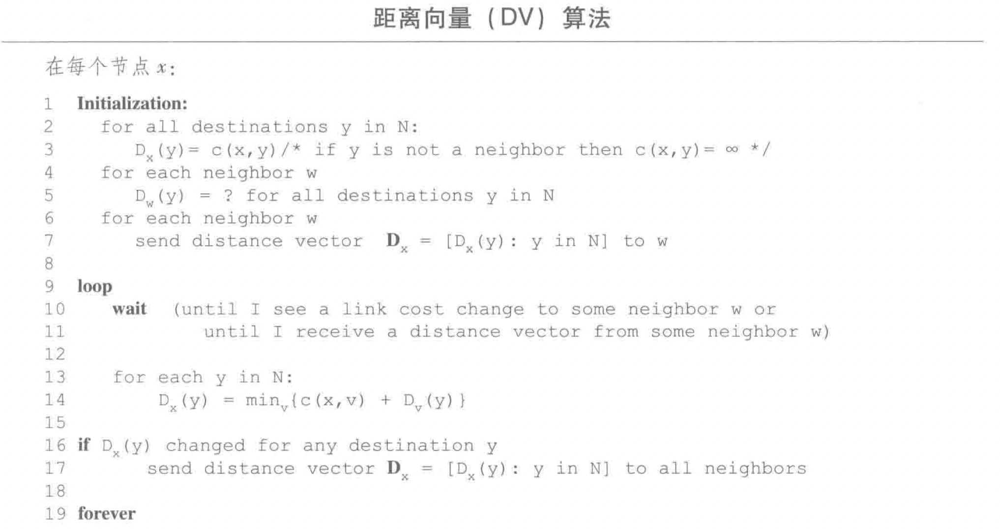
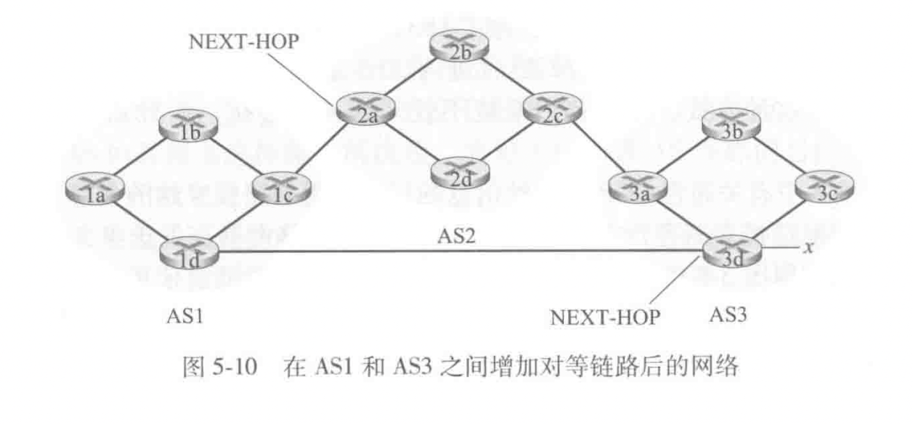
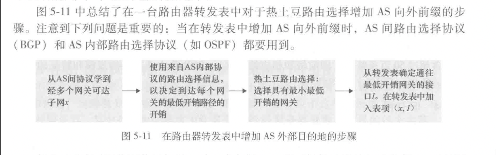
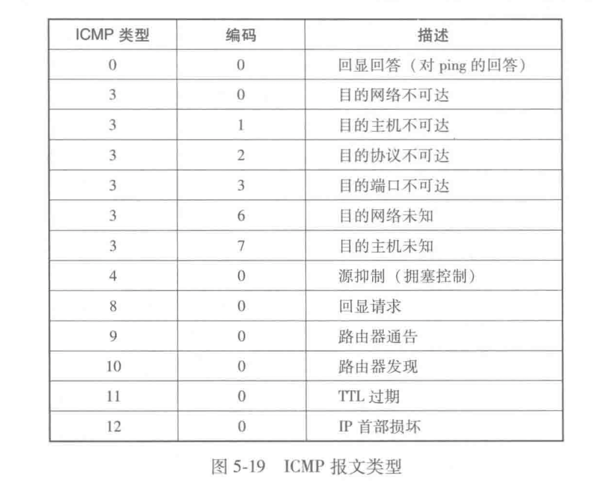

# 第五章-网络层：控制平面

在本章中，我们将学习这些转发表和流表是如何计算、维护和安装的。在4.1 节的网络层概述中，我们已经学习了完成这些工作有两种可能的方法。

1. 每路由器控制

    每台路由器有一个路由选择组件，用于与其他路由器中的路由选择组件通信，以计算其转发表的值。

2. 逻辑集中式控制

## 路由选择算法

目的：从发送方到接收方的过程中确定一条通过路由器网络的好的（开销最低）路径（等价于路由）

分类：

### 链路状态路由选择算法（LS）

网络拓扑和所有的链路开销都是已知的，在链路状态算法中，网络拓扑和所有的链路开销都是已知的，也就是说可用作LS算法的输入。实践中这是通过让每个节点向网络中所有其他节点广播链路状态分组来完成的，其中每个链路状态分组包含它所连接的链路的标识和开销。

采用的是 dijkstra 算法.

算法复杂度 $O(n^2)$

信息复杂度：每一个路由都需要将他的链路状态广播到整个网络；高效的广播算法需要经过 $O(n)$ 的链路才能传遍整个网络，那么整个网络的信息复杂度就是 $O(n^2)$

潜在的问题：

实践中，链路开销一般等于链路上的负载，例如反应要历经的时延，但是这样会导致振荡（见教材p 253 例）

### 距离向量路由选择算法（DV）

基于 bellman-ford（动态规划）

1. 距离向量算法在链路开销改变的时候容易产生链路故障（选择环路-routing loop）
2. 可以通过增加“毒性逆转”的方式来避免一些简单的链路故障

距离向量表维护自己的和邻居的距离向量

## 因特网中自治系统内部的路由选择 ospf

实践过程中存在两个问题：“规模”和“管理自治”的问题

上述问题通过将路由器组织进“自治系统”（autonomous system, as）来解决

在相同路由系统中的路由器都运行相同的路由选择算法并且有彼此的信息。在一个自治系统内运行的路由选择算法叫做“自治系统内部路由选择协议”

需要解决两个问题：

1. 确定自治系统内的哪个路由器与其他哪个自治系统连接
2. 将这些可达性信息传播到整个网络

### 开放最短路优先（OSPF）

一种自治系统内的路由协议。

算法细节比较多

## ISP（AS） 之间的路由选择：边界网关协议（BGP）

网关：两个不同 AS 之间的连接部分

在 bgp 中，分组（packet）不会被直接路由到一个特定的目的地址，而是路由到一个**CIDR化的前缀（一个子网或者子网的集合）**

一台路由器的转发表将具有 （x, I）的表项，其中 x 是一个前缀，I 是**该路由器**的接口之一的接口号

### BGP 的作用

### 通告 BGP 路由信息

在 BGP 中，每对路由器通过使用 179 端口的半永久 TCP 连接交换路由选择信息。

每条直接连接以及所有通过该连接发送的 BGP 报文，称为 BGP 连接。（注意虽然 BGP 是 AS 间的，但是 BGP 报文是可以在 AS 内部传递的，因为要对所有的路由器传递可达性信息）

BGP 报文：“AS3 x”（经过 AS3 到达前缀 x）

分为 eBGP 和 iBGP（AS 外部和内部）

### 确定最好的路由

当路由器通过 BGP 连接通告前缀的时候，会在前缀中加上一些 **BGP属性**

两个比较重要的 BGP 属性是 AS-PATH 和 NEXT-HOP

一个例子，AS1 中的每台路由器都知道了到前缀 x 的两台 BGP 路由：

> 路由器 2a 的最左侧接口的 IP 地址; AS2 AS3; x
>
> 路由器 3d 的最左侧接口的 IP 地址; AS3; x

### 热土豆路由选择

核心思想是，尽可能快地将分组送出 AS，而不考虑出 AS 后到达目的地剩下部分的开销

### 路由器选择算法

在实践中，采用这种更加复杂的算法：

输入：到达某前缀的所有路由的集合

顺序调用以下消除规则知道余下一条：

1. 路由被指派一个**本地偏好**值作为属性之一（除 next-hop 与 as-path 之外）本地偏好属性的值可能由该路由器设置或者从 AS 内的其他路由器学到。完全取决于 AS 的网络管理员。保留具有最高本地偏好值的路由
2. 若本地偏好值都相同，选择具有最短 AS-path 的路由；若该规则是路由选择的唯一规则，则 BGP 采用距离向量算法决定路径，距离测度使用 AS 的跳数（而不是路由器的跳数）
3. 对剩下的路由采用热土豆路由选择
4. 如果仍有剩余，采用 BGP 标识符来选择路由（无需深入了解）

## ICMP：因特网控制报文协议

ICMP 被主机和路由器用来彼此沟通网络层的信息。最典型的用途是差错报告

ICMP 通常被认为是 IP 的一部分，其报文是承载在 IP 分组中的（就像 TCP UDP 报文段作为 IP 的有效载荷被承载那样）

ICMP 报文有一个类型字段和一个编码字段，并且包含引起该 lCMP 报文首次生成的 IP 数据报的首部和前 8 个字节（以便发送方能确定引发该差错的数据报）。在图 5-19 中显示了所选的 ICMP 报文类型。注意到 ICMP 报文并不仅是用于通知差错情况。

