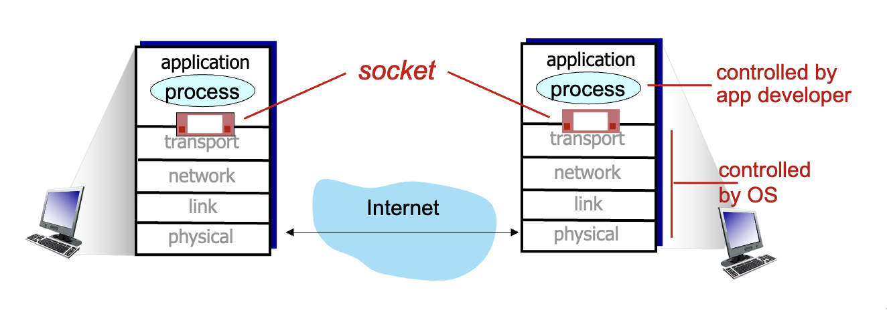
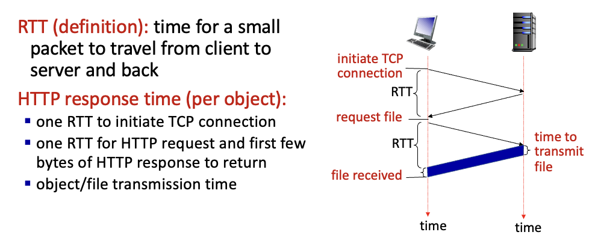
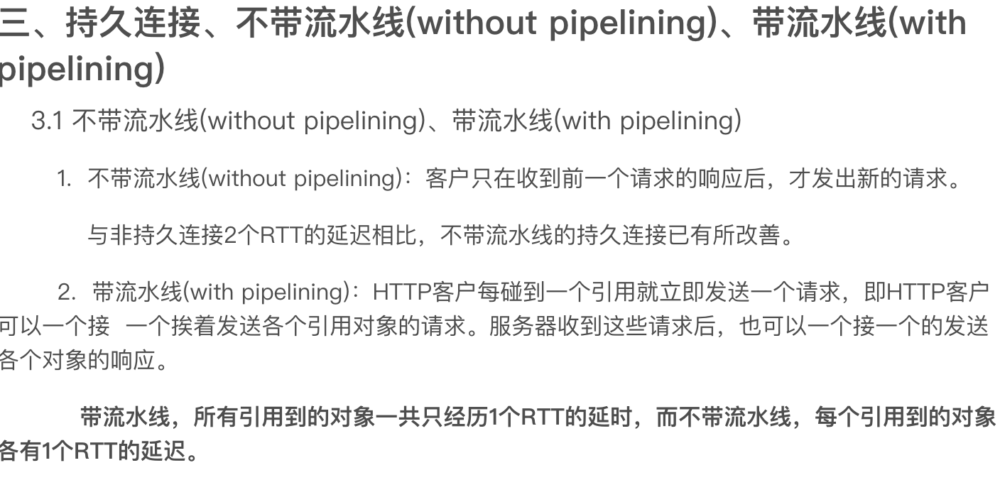
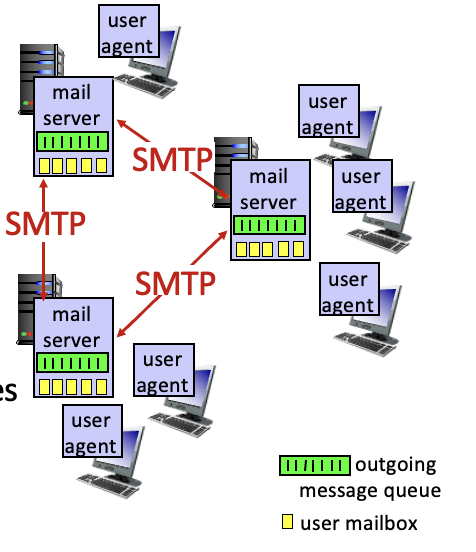
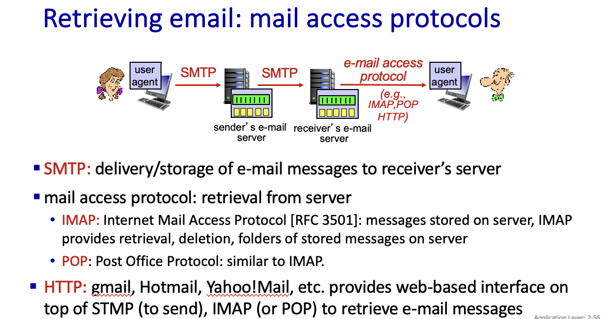
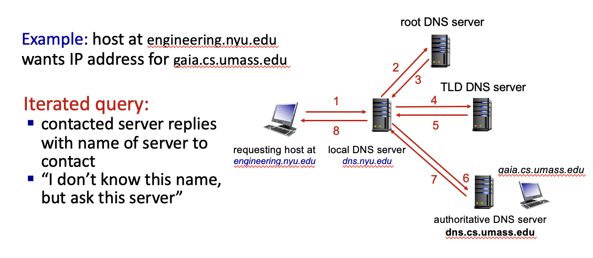
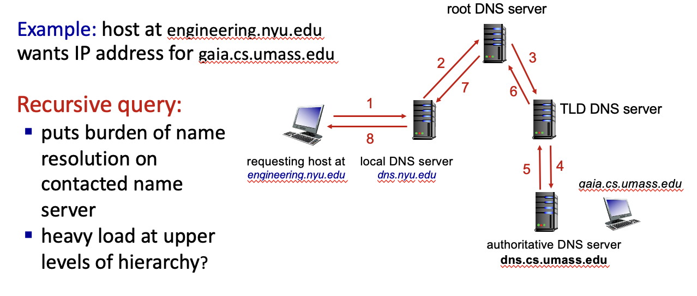

# 第二章-应用层

## 不同的架构：

client-server architecture

- servers: always-on host; permanent IP address
- clients: contact with server; maybe offline; may have dynamic address; donot connect with each other directly;

peer-to-peer architecture

- no always-on server
- arbitrary host directly communicate
- peers request and provide service
- peers are intermittently connected and change IP address(complex management)

---

## 进程（Process）间交流

同一主机：由操作系统决定

不同主机：exchanging messages(交换报文)

---

## Sockets（套接字）

进程从套接字接收信息/传递信息给套接字

---

## Identifier（辨识符）

> *identifier* includes both IP address and port numbers associated with process on host.

为了给特定的进程通信，目的地需要一个地址（IP address + port）

IP 地址用来标识主机，通过端口来区分不同的进程

---

## 应用层协议

> 把报文发送进socket就可以实现网络进程间的通信，但如何构造这些报文？含义？进程、报文如何互动？应用层协议！

### HTTP 协议

- Web’s application-layer protocol
- client/server model:
- *client:* browser that requests, receives, (using HTTP protocol) and “displays” Web objects
- *server:* Web server sends (using HTTP protocol) objects in response to requests

*HTTP uses TCP and it is “stateless”*

- server maintains *no* information about past client requests

two types:

- Non-persistent HTTP
- persistent HTTP

RTT (**round** trip time)：time for a small packet to travel from client to server **and back**

---

Non-persistent HTTP’s response time:

> Non-persistent HTTP response time for N files = 2N RTT + N file transmission time（每次都要重发请求）
>
> But for Persistent HTTP resonse time = 2 RTT + N file transmission time（带流水线）

---

maintaining user/server state: cookies

> Web sites and client browser  use cookies to maintain some state between transactions

---

网页缓存：

用户可以配置一个（可以是本地的）网页缓存，这样浏览器会将所有的请求发送给网页缓存，这样网页缓存会在 object in cache 时直接返回，不存在时由 cache 向源服务器发送请求。（代理服务器, proxy server）

*Why* Web caching?

- reduce response time for client request
- cache is closer to client
- reduce traffic on an institution’s access link
- Internet is dense with caches
- enables “poor” content providers to more effectively deliver content

---

一些乱七八糟的小点：

conditional get(用于检查 cache 是否 up-to-date)

HOL(head of line) blocking: http2 通过按帧分割传输减轻了这个问题

### E-mail, SMTP, IMAP

Three major components:

- user agents
- mail servers
- simple mail transfer protocol: SMTP

User Agent

- a.k.a. “mail reader”
- composing, editing, reading mail messages
- e.g., Outlook, iPhone mail client
- outgoing, incoming messages stored on server

mail servers:

- *mailbox* contains incoming messages for user
- *message queue* of outgoing (to be sent) mail messages

SMTP protocol between mail servers to send email messages

- client: sending mail server
- “server”: receiving mail server

PPT 第 52 张有一个 smtp(simple mail transfer protocol)+tcp 传输邮件的实例

---

smtp:push; imap/pop: pull

---

### The Domain Name System(DNS)

- hostname-to-IP_address translation
- canonical, alias names

root dns servers - top-level domain(tld) dns servers - authoritative dns servers - local dns name servers

**DNS name resolution:** 

- iterated query（迭代查询）

- recursive query（递归查询）

DNS records:

> DNS: distributed database storing resource records (RR)
>
> RR format: (name, value, type, ttl)

---

### p2p applications

file distribution: client-server v.s. p2p （可能会有计算题）

---

### video streaming and content distribution networks

上面这个内容没听到，要补

---