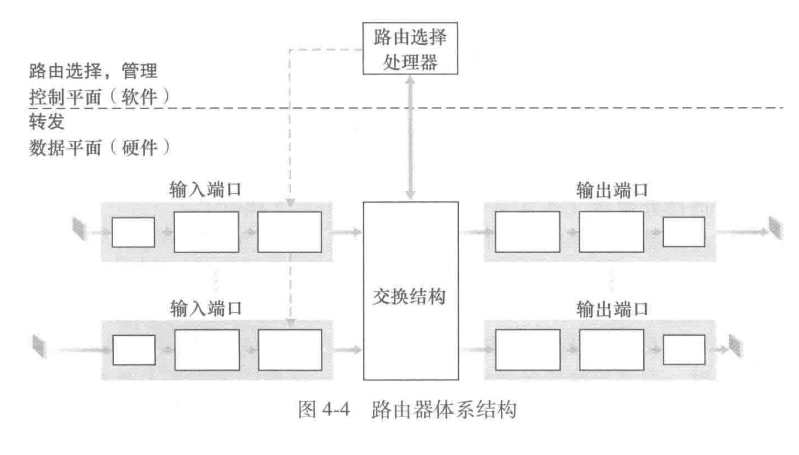
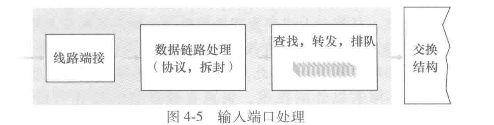
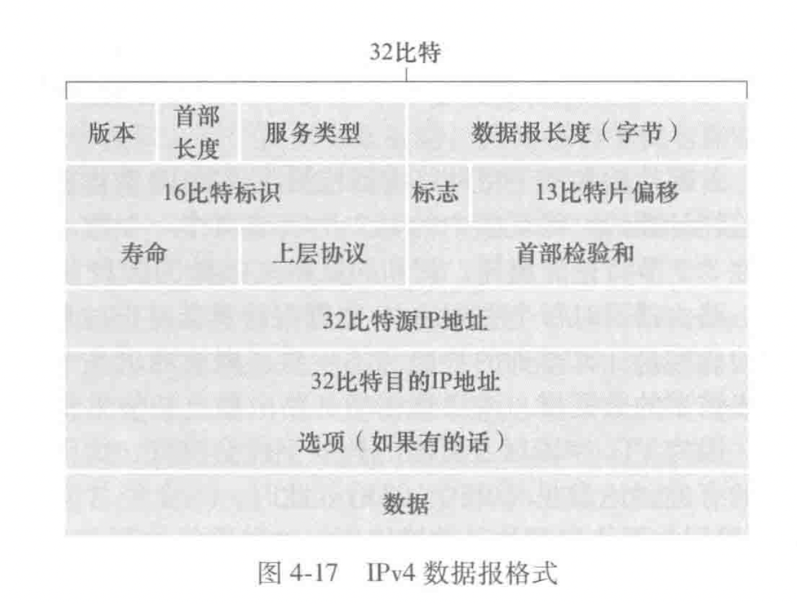
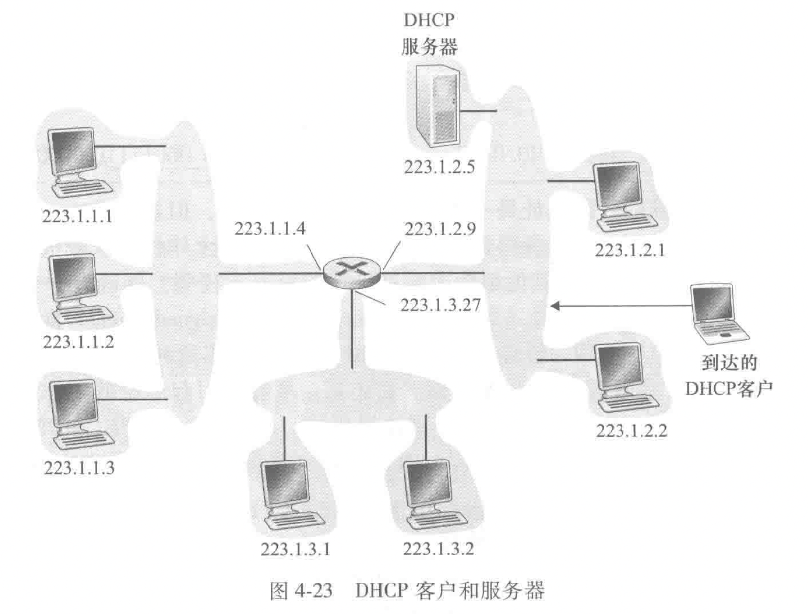
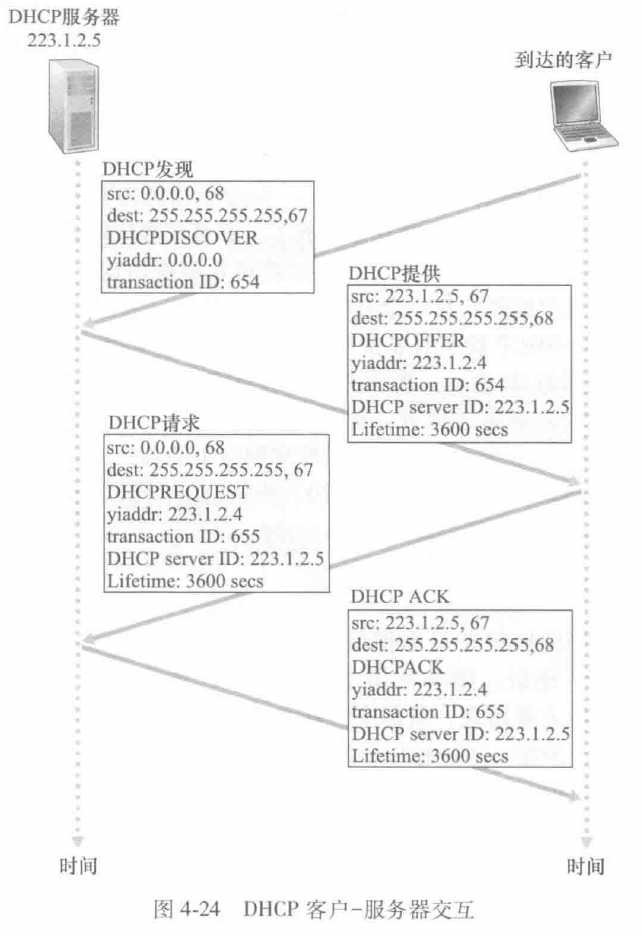
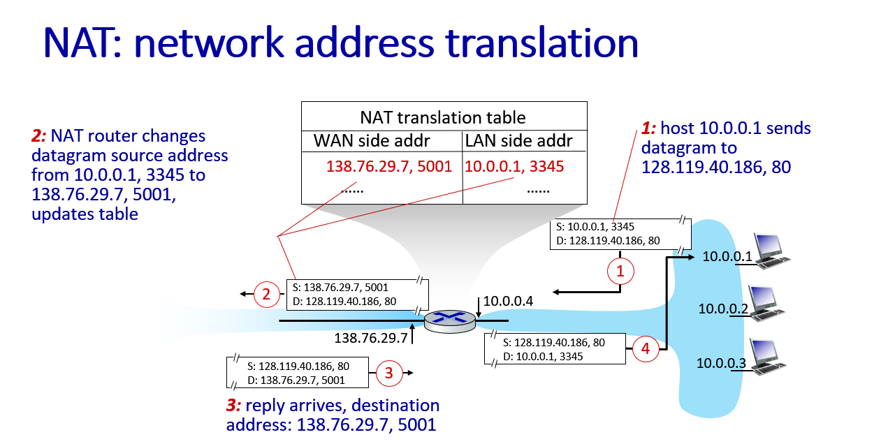
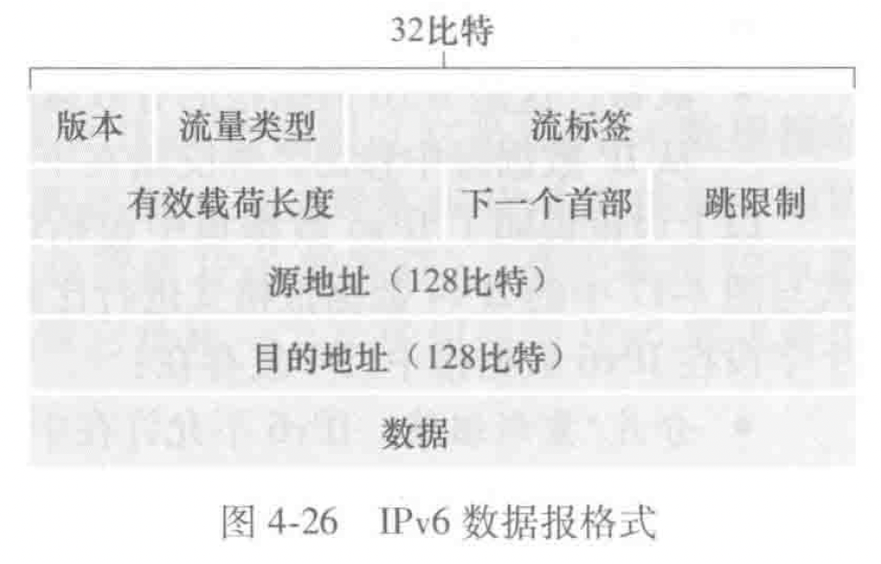

# 第四章-网络层：数据平面

## 网络层概述

网络层能被分解成两个相互作用的部分，数据平面和控制平面。

数据平面：从其输入链路向其输出链路转发数据报

控制平面：协调这些本地的每路由器转发操作

（路由器不运行应用层和运输层协议）

### 转发和路由选择：数据平面和控制平面

转发：一个分组到达某个路由器的输入链路，路由器将该分组移动到适当的输出链路（数据平面中的唯一功能）

路由选择：当分组从发送方流向接收方时，网络层必须决定这些分组所采用的路由或路径（决定从一个主机到另一个主机所遵循的路径，控制平面中实现）

转发表（每台网络路由器）：路由器检查到达分组首部的一个或多个字段值，在转发表中用首部值索引，来转发分组（首部-输出链路号的有序对）

### 网络服务模型（best-effort service model）

- 确保交付. 该服务确保分组最终到达目的地
- 具有时延上限的确保交付. 该服务不仅确保分组的交付而且在特定的主机到主机时延上界内交付
- 有序分组交付. 该服务确保分组以发送的顺序到达目的地
- 确保最小带宽. 这种网络层服务模仿在发送和接收主机之间一条特定比特率的传输链路的行为. 只要发送主机以低于特定比特率的速度传输比特（作为分组的组成部分），则所有分组最终会交付到目的主机
- 安全性：网络层能够在源加密所有数据报并在目的地解密它们，从而对所有运输层报文段提供机密性

## 路由器工作原理

输入端口：这里的端口指的是路由器的物理输入和输出接口；

三个方框：左 - 在路由器中执行终结 入物理链路(line termination) 的物理层功能；中 - 与位于入链路远端的数据链路层交互操作来执行数据链路层功能(link layer processing)；右 - 执行查找功能（查询转发表决定路由器输出端口）(lookup forwarding queueing )

交换结构：链接输入端口和输出端口。是网络路由器中的网络

输出端口：存储从交换结构接收的分组，通过执行必要的链路层和物理层功能在输出链路上传输这些分组。

路由选择处理器：路由选择处理器执行控制平面功能

### 输入端口处理和基于目的地转发

查找表可以看作是一个目的地址到链路借口的映射，但是由于目的地址范围通常很大，这时可以采用一种最长前缀匹配（longest prefix matching）的方式来转发

一旦通过查找确定了某分组的输出端口，该分组就能进入交换结构

### 交换

三种交换技术（内存、总线、互联网络）

- 经内存交换
    1. 分组到达输入端口，发送路由选择处理器中断信号
    2. 分组从输入端口被复制到路由选择处理器内存中，路由选择处理器从首部提取目的地址
    3. 在转发表中查找适当的输出端口
    4. 分组被复制到输出端口的缓存中

    若每秒可写进/读出内存最多 b 个分组，则吞吐量必然小于 b/2，不能同时转发两个分组，因为经过共享系统总线一次仅能执行一个内存读/写

- 经总线交换

    输入端口经过一根总线将分组直接传送到输出端口

    1. 输入端口为分组计划一个交换机内部标签，指示本地输出端口
    2. 分组在总线上传送和传输到输出端口，该分组能被所有输出端口收到
    3. 仅有与标签匹配的端口才能保存该分组。然后去除标签

    一次只有一个分组能够跨越总线，路由器的交换带宽受到总线速率的限制

- 经互联网络交换

    克服单一、共享式总线带宽限制，使用一个更复杂的互联网络。

    纵横式交换机由 2n 条总线组成，连接 n 个输入端口和 n 个输出端口；输入端口和输出端口横纵交叉，交叉点通过交换结构控制器在任何时候开启和闭合（阻塞小）

### 输出端口处理

输出端口处理去除已经存放在输出端口内存的分组将其发送到输出链路上，包括选择和去除排队的分组进行传输，执行所需的链路层和物理层功能.

### 何处出现排队？

假定输入线路速率与输出线路速率相同，记为 $R_{\rm line}$（分组数/s），有 n 个输入端口 n 个输出端口，假定所有分组有相同的固定长度，以同步的方式到达输入端口.（在相同的时间间隔内，一个输入链路上能到达 0/1 个分组）

定义交换结构传送速率 $R_{\rm switch}$ 为从输入端口到输出端口能够移动分组的速率，若 $R_{\rm switch}$ 是 $R_{\rm line}$ 的 n 倍，则在输入端口处会出现微不足道的排队.

1. 输入排队

队列首部堵塞：一个输入队列中排队的分组必须等待交换结构发送，因为它被位于队列首部的另一个分组所阻塞.

1. 输出排队

当输出端口没有足够的内存来缓存一个入分组时，要么**丢弃到达的分组（弃尾）**要么删除一个或多个已经排队的分组.

1. 要多少缓存？

缓存数量应当等于平均往返时延（rtt）乘上链路容量（c）-经验公式

当有大量的 tcp 流 (n 条）流过链路时，所需缓存数量为：$B={\rm RTT}\cdot C/\sqrt N$

### 分组调度

1. 先进先出(fcfs,fifo)
2. 优先权排队，每一个分组有自己的优先权；当选择一个分组传输时，优先权排队规则将从优先权最高的非空队列选择传输一个分组，同一个优先权累采用 fifo 方式
3. 循环和加权公平排队：分类循环传输分组（加权循环）

## 网际协议：ipv4、寻址、ipv6以及其他

### ipv4 数据报格式

- 版本：不同的 ip 版本使用不同的数据报格式
- 首部长度：ipv4 数据包可能包含一些可变数量的选项，用这 4 比特来确定载荷时即开始的地方，大多数不包含选项，所以一般的首部 **20 字节**
- 服务类型（tos）
- 数据包长度
- 标识、标志、片偏移：大的 ip 数据报可能会被分片
- 寿命（time-to-live, ttl）：每当一台路由器处理数据包时，该值减一，若减为 0，则数据报被丢弃. 来防止数据报不会永远在网络中循环.
- 协议，该字段值指示 ip 数据报的数据部分应该交给哪个特定的运输层协议
- 检验和（chksum）
- 地址
- 选项
- 数据（有效载荷，payload）

### ipv4 编址

主机与物理链路之间的边界叫做**接口（interface）**

子网和子网掩码.（掩码掩住的部分被称作网络部分）

ip 广播地址 255.255.255.255：当一台主机发送一个目的地址为 255.255.255.255 的数据报时，该报文会交付给同一个网络中的所有主机.

先看一个组织是如何为其设备得到一个地址块，然后再看一个设备如何从某组织的地址块中分配到一个地址.

1. 获取一块地址

从 isp 处获取一块主机地址

1. 获取主机地址：**动态主机配置协议（dhcp）**

dhcp 可以被配置成让某给定主机每次与网络连接时得到相同的 ip 地址，或者被分配一个临时的 ip 地址.

dhcp 还可以让主机得知其他信息，例如子网掩码，第一跳路由器地址（默认网关）

dhcp 具有将主机连接到一个网络的网络相关方面的自动化能力，故又常被称为即插即用协议或者零配置协议

dhcp 是一个**客户-服务器协议**，通常情况下每个子网都有一台 dhcp 服务器或者一个 dhcp 中继代理（比如路由器）来告知该网络的 dhcp 服务器地址

对于一台新到达的主机，dhcp 是一个四步骤的过程：

1. dhcp 服务器发现

发送一个 **dhcp 发送报文**，客户在 udp 分组中向端口 67 发送该报文

使用广播目的地址 255.255.255.255 和“本主机”源 ip 地址 0.0.0.0，dhcp 客户将该 ip 数据报传递给链路层，链路层将该帧广播到所有与该子网连接的节点

1. dhcp 服务器提供

dhcp 服务器收到一个 dhcp 发现报文时，用 **dhcp 提供报文** 向客户做出响应。仍然使用 ip 广播地址。同时，因为可能在子网中有多个 dhcp 服务器，需要选择最优位置.

每台服务器提供的报文包含收到的发现报文的事务 id、向客户推荐的 ip 地址、网络掩码以及 ip 地址租用期.

1. dhcp 请求

客户从一个或多个服务器提供中选择一个，并向选中的服务器提供用 **dhcp 请求报文** 进行响应，回显配置的参数.

1. dhcp ack

服务器用 dhcp ack 报文对 dhcp 请求报文进行响应，证实所要求的参数

dhcp 还提供了一种机制以允许客户更新它对一个 ip 地址的租用

在 dhcp ack 报文中还存储了：1. 对于用户来说下一跳路由器地址 2. DNS 服务器的名称和地址 3. 子网掩码

### 网络地址转换 （network address translation）

地址空间 10.0.0.0/8 是保留的三部分 ip 地址空间之一（另外两个是 172.16/12, 192.168/16），这些地址由于家庭网络等专用网络或具有专用地址的地域（指地址仅对该网络中的设备有意义的网络）

nat 路由器对外界的行为如同一个具有单一 ip 地址的单一设备。路由器从 isp 的 dhcp 获取自己的地址，并且在路由器上运行一个 dhcp 服务器，为家庭网络提供地址

nat 路由器上的 nat 转换表 告知路由器应该将某个分组转发给哪个内部主机

### ipv6

首部大小为 40 字节

版本

流量类型：与 ipv4 的 tos 字段含义相似

流标签：用于标识一条数据报的流，能够对一条流中的某些数据报给出优先权，或者他能够用来对来自某些应用的数据报给出更高的优先权

有效载荷长度

下一个首部：标识数据报的内容需要交付给那一个协议（tcp or udp 等）与 ipv4 首部中协议字段相同的值

跳限制：每台路由器对该字段内容减 1，如果收到是为 0，则丢弃

源地址和目标地址

数据

### 从 ipv4 到 v6 的迁移

采用的是一种建隧道的方法：两个 ipv6 节点用 ipv6 数据包进行交互，他们是经由中间 ipv4 路由器互联的。将两台 ipv6 路由器之间的 ipv4 路由器称为隧道（tunnel）

将 ipv6 数据报放到一个 ipv4 数据报的数字（载荷）字段中再进行传输

## 泛化转发和 sdn

考虑更有意义的通用“匹配加操作”范式：其中能够对协议栈的多个首部字段进行“匹配”，这些首部字段是与不同层次的不同协议相关联的.

（跳过了没讲）

## 中间盒（middle box）

> 在源主机和目的主机之间的数据路径上，执行除了 ip 路由器的正常标准功能之外的其他功能的任何中间的盒子

中间盒提供的三种服务：

1. nat 转换. nat 盒实现了专用网络寻址、重写数据报首部 ip 地址和端口号
2. 安全服务. 防火墙基于首部字段值或重定向分组来阻塞流量，从而进行附加处理.
3. 性能增强. 想能够提供所需服务的服务器集合之一，执行诸如压缩、内容缓存和负载均衡等服务的服务请求
