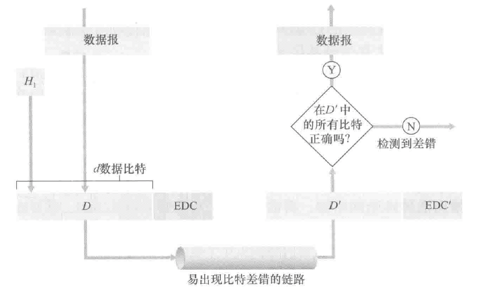

# 第六章-链路层和局域网

## 链路层概述

链路层：Link Layer

局域网：Local Area Network（LAN）

将运行链路层协议的任何设备均称为节点（node）

把沿着通信路径链接相邻节点的通信信道称为**链路**（link）

传输节点将**数据报**（datagram）封装在链路层**帧**（frame）中

举例：

> 旅行社安排游客从 A 城坐飞机到 B 城，转高铁到 C 城
>
> 游客：数据报
>
> 旅行社：路由选择协议
>
> A,B,C 三城：节点
>
> 每个运输区段：链路
>
> 运输方式：链路层协议（相邻两个节点之间）

### 链路层提供的服务

- 成帧：将数据报封装成帧，帧的结构由链路层协议规定。有多种帧格式
- 链路接入：介质访问控制（medium access control, MAC）协议规定了帧在链路上传输的规则 。MAC 协议用于协调多个节点的帧传输。
- 可靠交付：链路层的可靠交付服务通常是通过确认和重传取得的
- 差错检测和纠正：接收方不仅能检测帧中出现的比特差错，而且能够准确地确定帧中的差错出现的位置（并纠正这些差错）

链路层在称为网络适配器的芯片上实现的。

## 差错检测和纠正技术

在发送节点，为了保护比特免受差错，使用差错检测和纠正比特（EDC）来增强数据 D，保护 header 和 payload

接收方的挑战是在只收到 D’& EDC’ 的情况下，确定 D’ 是否和初始的 D 相同。（几乎总是能检测出已经出现的比特差错，但也还是可能有未检出比特差错，undetected bit error）

### 奇偶校验

单比特奇偶校验（补上校验位后成奇/偶）

二维奇偶校验方案

在单个比特出错的情况下可以直接定位发生差错的比特并纠正。二维奇偶校验也能检测（但不能纠正）两个比特差错的组合

接收方检测和纠正差错的能力被称为**前向纠错**（forward error correction, FEC）

### 检验和（checksum）方法

将数据的字节作为 16 比特的整数对待并求和。这个和的反码形成了携带在报文段首部的因特网检验和。

一般只在运输层使用检验和方法，因为这种方法更快速，适合用软件实现。而现实中链路层采用硬件实现了名为 CRC 的方法

### 循环冗余检测（cyclic redundancy check, CRC）

CRC 编码也称为多项式编码，该编码将要发送的比特串看作系数为0和1的一个多项式

所有 CRC 编码采用模 2 算术来做（在加法中不进位，减法中不借位，等价于按位异或操作）

假设发送方要发送 d 比特的数据，首先发送方与接收方协商一个 r+1 比特的模式（我习惯叫成模式串），称为**生成多项式（generator）**，记为 G，要求 G 的最高位为 1

需要计算出 $R=\text{remainder}\frac{D\cdot2^r}{G}$ 使得 G 整除 $D\cdot2^r\text{ xor } R$

记住这里的 remainder 是模 2 算术下的

如果采用的是国际标准的比特生成多项式 G，则能检测小于 r+1 个比特的突发差错，也能够检测任何奇数个比特差错.

## 多路访问链路和协议

存在两种类型的网络链路：点对点链路和广播链路

点对点链路（point-to-point link）由链路一段的单个发送方和链路另一端的单个接收方组成。常见的链路层协议有点对点协议（point-to-point protocol, PPP）和高级数据链路控制（high-level data link control, HDLC）

广播链路（broadcast link）能够让多个发送和接收节点都连接到相同的、单一的、共享的广播信道上。以太网和无线局域网就是广播链路层技术的例子。（既能发送也能接收）

**多路访问问题：**如何协调多个发送和接收节点对一个共享广播信道的访问，多路访问协议（multiple access protocol）规范节点在共享的广播信道上的传输行为。

理想情况下，对于速率为 R bps 的广播信道，多路访问协议应该具有以下所希望的特性：

1. 当仅有一个节点发送数据时，该节点具有 R bps 的吞吐量；
2. 当有 M 个节点发送数据时，每个节点吞吐量为 R/M bps。 这不必要求 M 个节点中的每一个节点总是有 R/M 的瞬间速率，而是每个节点在一些适当定义的时间间隔内应该有 R/M 的平均传输速率
3. 协议是去中心化的；这就是说不会因某主节点故障而使整个系统崩溃。
4. 协议是简单的，使实现不昂贵。

总的来说，可以将多路访问协议划分成以下 3 种类型之一

### 信道划分协议（channel partitioning protocol）

通过时分多路复用（tdm，将一个时间帧划分成 n 个时隙）或者频分多路复用（fdm）将信道进行划分：

优点：消除了碰撞而且非常公平，每个节点都得到了 r/n bps 的传输速率

缺点：传输速率被限制，即便在只有自己要传送数据的时候

### 随机接入协议（random access protocol）

在随机接入协议中，一个传输节点总是以信道的全部速率（R bps）进行发送。当有碰撞时，涉及碰撞的每个节点反复地重发它的帧，到该帧无碰撞地通过位置。但是当一个节点设计一次碰撞时，它不必立刻重发该帧。**相反，它在重发该帧之前等待一个随机时延（独立选择）。**

常用的随机接入协议包括 ALOHA 协议和载波侦听多路访问（CSMA）协议

### 时隙 ALOHA

刚好有一个节点传输的时隙称为一个成功时隙（successful slot）。时隙多路访问协议的效率定义为：当有大量的活跃节点切每个节点总有大量的帧要发送时，长期运行中成功时隙的份额。

假设每个节点试图在每个时隙以概率 p 传输一帧，假设有 N 个节点，则一个给定时隙时成功时隙的概率为 $p(1-p)^{N-1}$，因为有 N 个节点，任意一个节点成功传送的概率为 $Np(1-p)^{N-1}$ 。经过计算，发现这个协议的最大效率为 $1/e=0.37$

### ALOHA

时隙 aloha 要求所有节点同步他们的传输，以在每个时隙开始时开始传输。在纯 aloha 中，当一帧首次到达，节点立刻将该帧完整地传输进广播信道。

如果一个传输的帧与一个或多个传输经历了碰撞，这个节点将立刻以概率 p 重传该帧。否则，该节点等待一个帧传输时间，在此等待之后，以概率 p 传输该帧，或者继续等待.

则对于一个节点，成功传输一次要求在前一段时间间隔和自己传输时都不能有其他节点开始传输，这个概率为 $(1-p)^{2(N-1)}$，则成功传输一次的总概率为 $p(1-p)^{2(N-1)}$，最大效率仅为 $1/(2e)$

### 载波侦听多路访问（CSMA，CSMA/CD）

载波侦听：一个节点在传输前先听信道。如果来自另一个节点的帧正向信道上发送，节点则等待直到检测到一小段时间没有传输，然后开始传输。

碰撞检测：当一个传输节点在传输时一直在侦听此信道。如果检测到了另一个节点正在传输干扰帧，它就停止传输（让别人传），在重复“侦听-当空闲时传输”循环之前等待一段随机时间。

由于传播时延的存在，即使存在载波侦听，还是会存在碰撞，故需要碰撞检测

右图：D往右传在先，但是检测到了 A，所以先停；A 往左传在先，但是检测到了 D，也先停

1. 适配器从网络层一条获得数据报，准备链路层帧，并将其放入帧适配器缓存中。
2. 如果适配器侦听到信道空闲（即无信号能量从信道进入适配器），它开始传输帧。在另一方面，如果适配器侦听到信道正在忙，它将等待，直到侦听到没有信号能量时才开始传输帧。
3. 在传输过程中，适配器监视来自其他使用该广播信道的适配器的信号能量的存在。
4. 如果适配器传输整个帧而未检测到来自其他适配器的信号能量，该适配器就完成了该帧。在另一方面，如果适配器在传输时检测到来自其他适配器的信号能量，它中止传输
5. 中止传输后，适配器等待一个随机时间量，然后返回步骤 2

当碰撞节点数量较少时，时间间隔较短；当碰撞节点数量较大时，时间间隔较长。

**二进制指数后退算法：**当传输一个给定帧时，若经历了一连串的 n 次碰撞，节点随机地从 $\{0,1,2,\cdots,2^{n}-1\}$ 中选择一个 K 值，一个帧碰撞越多，K 选择的间隔越大。对于以太网，一个节点等待的实际时间量是 K·512 比特时间（发送 512 比特进入以太网所需时间量的 K 倍）

---

CSMA/CD 效率：当有大量的活跃节点，且每个节点有大量的帧要发送时，帧在信道中无碰撞地传输的那部分时间在长期运行时间中所占的份额。（与某个具体节点无关）

令 $d_{prop}$ 表示信号能量在任意两个适配器之间传播所需的最大时间，令 $d_{trans}$ 表示传输一个最大长度的以太网帧的时间：

$$
\text{效率}=\frac{1}{1+5d_{\text{prop}}/d_{\text{trans}}}
$$

从这个公式我们看到，当 $d_{\text{prop}}$ 接近 0 时，效率接近1 。这和我们的直觉相符，如果传播时延是 0, 碰撞的节点将立即中止而不会浪费信道。同时，当 $d_{\text{trans}}$ 变得很大时，效率也接近于 1 。这也和直觉相符，因为当一个帧取得了信道时，它将占有信道很长时间；因此信道在大多数时间都会有效地工作。

---

多路访问协议的两个理想特性是：

1. 当仅有一个节点发送数据时，该节点具有 R bps 的吞吐量；
2. 当有 M 个节点发送数据时，每个节点吞吐量为 R/M bps。 这不必要求 M 个节点中的每一个节点总是有 R/M 的瞬间速率，而是每个节点在一些适当定义的时间间隔内应该有 R/M 的平均传输速率

ALOHA 和 CSMA 协议具备第一个特性，但不具备第二个特性。

### 轮流协议（taking-turns protocol）

讨论两种比较重要的协议。

第一种是轮询协议，轮询协议要求这些节点之一要被指定为主节点。主节点以循环的方式轮询(poll) 每个节点。特别是，主节点首先向节点 1 发送一个报文，告诉它（节点 1) 能够传输的帧的最多数量。在节点 1 传输了某些帧后，主节点告诉节点 2 它（节点2) 能够传输的帧的最多数量。（主节点能够通过观察在信道上是否缺乏信号，来决定一个节点何时完成了帧的发送。）上述过程以这种方式继续进行，主节点以循环的方式轮询了每个节点。

第一个缺点是该协议引入了轮询时延，即通知一个节点”它可以传输”所需的时间。例如，如果只有一个节点是活跃的，那么这个节点将以小于 R bps 的速率传输，因为每次活跃节点发送了它最多数量的帧时，主节点必须依次轮询每一个非活跃的节点。第二个缺点可能更为严重，就是如果主节点有故障，整个信道都变得不可操作。蓝牙协议就是轮询协议的例子。

第二种轮流协议是令牌传递协议 (token-passing protocol) 。在这种协议中没有主节点。

一个称为令牌 (token) 的小的特殊帧在节点之间以某种固定的次序进行交换。

缺点：一个节点的故障可能会使整个信道崩溃。或者如果一个节点偶然忘记了释放令牌，则必须调用某些恢复步骤使令牌返回到循环中来

## 交换局域网

交换机运行在链路层，交换链路层帧，不识别网络层地址，而是链路层地址.

### 链路层寻址和 arp（地址解析协议）

区分网络层地址和链路层地址

1. MAC 地址（就是链路层地址）

事实上，并不是某个主机或路由器有链路层地址，而是它们的适配器（网络接口）有链路层地址.

具有多个网络接口的主机/路由器具有与之相关联的多个链路层地址.

MAC 地址长度 6 字节，共有 $2^{48}$ 个可能的地址，常用十六进制表示，每个字节表示为一对十六进制数. 没有两块适配器具有相同的地址.

**发送**：发送适配器将目的适配器的 mac 地址插入到将要发送的帧中，并将该帧发送到局域网上.

**接收**：适配器收到一个帧时，将检查该帧中的目的 mac 地址是否与它自己的 mac 地址匹配。如果匹配，提取出封装的数据报，沿协议栈向上传递。如果不匹配，该适配器会丢弃这个帧.

**广播**：广播地址是 48 个连续的 1 组成的字符串，即 FF-FF-FF-FF-FF-FF

1. 地址解析协议（在网络层地址和链路层地址之间进行转换）

每台主机或者路由器在其内存中维护一个 **ARP 表（ arp table ）**包含 ip 地址到 mac 地址的映射关系以及寿命值（time-to-live, ttl）

- 获取其他主机的 mac 地址。首先，发送方构造一个被称为 arp 分组（arp packet） 的特殊分组，包括发送和接收 ip 地址以及 mac 地址。arp 的查询和相应分组都具有相同的格式。发送主机向它的适配器传递一个 arp 查询分组，且指示适配器应该用 mac 广播地址来发送。与之匹配的一个主机给查询主机发送回一个相应 arp 分组
- 查询 arp 报文是在广播帧中发送的，而响应 arp 报文在一个标准帧中发送.

1. 发送数据报到子网以外

路由器的每个接口都有一个 arp 模块和适配器

主机 111.111.111.111 要向 222.222.222.222 发送一个 ip 数据报，需要指定一个适当的 mac 地址;

直接指定 222.222. 的 mac 地址是不现实的，因为子网的适配器不会维护这一转换（停留在链路层），故数据报必须首先发送给路由器接口 111.111.111.110（第一跳），这样才能从链路层转换到网络层，进行下一步的路由

### 以太网

交换机运行在第二层（链路层），而路由器运行在第三层（网络层）

以太网帧结构

- 前同步码（8字节）。个人理解是一种魔数。前七个字节相同（10101010），用于“唤醒”接收适配器，将它们的时钟和发送方的时钟相同步。第八个字节（10101011）警告适配器，”重要的内容要到了“
- 目的地址（6字节），目的适配器的 mac 地址，如果不是本适配器的地址或者广播地址就丢弃
- 源地址（6字节）
- 类型字段（2字节），标记数据报的网络层协议.
- 数据字段（46～1500字节），超过字节数必须要分片，小于字节数要填充
- crc（4字节）循环冗余检测字段，指示是否出现差错

1. 无连接服务，不需要握手.
2. 不可靠服务，收到既不发送确认帧也发送否定确认帧，没有通过 crc 校验只会直接丢弃

### 链路层交换机

交换机的任务是接收入链路层帧并将它们转发到出链路。交换机自身对子网中的主机和路由器是**透明**的。

1. 转发和过滤

过滤（filtering）是决定一个帧应该转发到某个端口还是应该丢弃

转发（forwarding）是决定一个帧应该被导向哪个端口

上述功能借助于交换机表（switch table）完成。交换机表包括局域网上某些主机和路由器的表项，但不必是全部的表项。

1. 一个 mac 地址 2.  通向该 mac 地址的交换机接口（对应一个局域网网段） 3. 表项放置在表中的时间

- 表中没有对应 DD-DD-DD-DD-DD-DD 的表项。 在这种情况下， 交换机向除接口 x 外的所有接口前面的输出缓存转发该帧的副本。 相当于广播
- 表中有 DD-DD-DD-DD-DD-DD 与接口 x 关联的表项。在这种情况下，该帧从包括适配器 DD-DD-DD-DD-DD-DD 的局域网网段到来。无须将该帧转发到任何其他接口， 交换机通过丢弃该帧执行过滤功能即可。
- 表中有 DD-DD-DD-DD-DD-DD 与接口 y (≠x) 关联的表项。在这种情况下，该帧需要被转发到与接口 y 相连的局域网网段。交换机通过将该帧放到接口 y 前面的输出缓存完成转发功能。

1. 自学习

交换机的表是自动、动态和自治地建立的

1. 交换机表初始为空。
2. 对于在每个接口接收到的每个入帧， 该交换机在其表中存储：在该帧源地址字段中的 MAC 地址； 该帧到达的接口； 当前时间。 交换机以这种方式在它的表中记录了发送节点所在的局域网网段。 如果在局域网上的每个主机最终都发送了一个帧， 则每个主机最终将在这张表中留有记录。
3. 如果在一段时间［称为老化期(aging time)] 后， 交换机没有接收到以该地址作为源地址的帧， 就在表中删除这个地址。 以这种方式， 如果一台PC被另一台PC（具有不同的适配器）代替， 原来PC的MAC地址将最终从该交换机表中被清除掉。

交换机是即插即用设备，交换机也是双工的， 这意味着任何交换机接口能够同时发送和接收。

1. 链路层交换机的性质

- 消除碰撞

    交换机缓存帧并且绝不会在网段上同时传输多于一个帧。 就像使用路由器 一样， 交换机的最大聚合带宽是该交换机所有接口速率之和。

- 异质的链路

     因此局域网中的不同链路能够以不同的速率 运行并且能够在不同的媒介上运行。

- 管理

1. 交换机和路由器比较

### 虚拟局域网（VLAN）

支持VLAN 的交换机允许经一个单一的物理局域网基础设施定义多个虚拟局域网。在一个VLAN 内的主机彼此通信，仿佛它们（并且没有其他主机）与交换机连接。在一个基于端口的VLAN 中，交换机的端口（接口）由网络管理员划分为组。每个组构成一个VLAN, 在每个VLAN 中的端口形成一个广播域（即来自一个端口的广播流最仅能到达该组中的其他端口）。

VLAN 间的互联：

1. 通过路由器（就像是分离的交换机）
2. VLAN 干线连接（VLAN trunking）

    每台交换机上的一个特殊端口（左侧交换机上的端口 16, 右侧交换机上的端口 1) 被配置为干线端口，以互联这两台 VLAN 交换机。该干线端口属于所有 VLAN, 发送到任何 VLAN 的帧经过干线链路转发到其他交换机。

    IEEE 定义了一种扩展的以太网帧格式-802.1Q，用于跨越 VLAN 干线的帧。该帧由标准以太网帧与加进首部的 4 字节 VLAN 标签（VLAN tag）组成

## 链路虚拟化：网络作为链路层

### 多协议标签交换（Multiprotocol Label Switching, MPLS）

目标：改善 ip 路由器的转发速度，使用固定长度的标签

- 不放弃基于目的地 ip 数据报转发的基础设施
- 使用固定的长度标识加快查找

使用长度标识出接口可以不接触分组的 IP 首部
