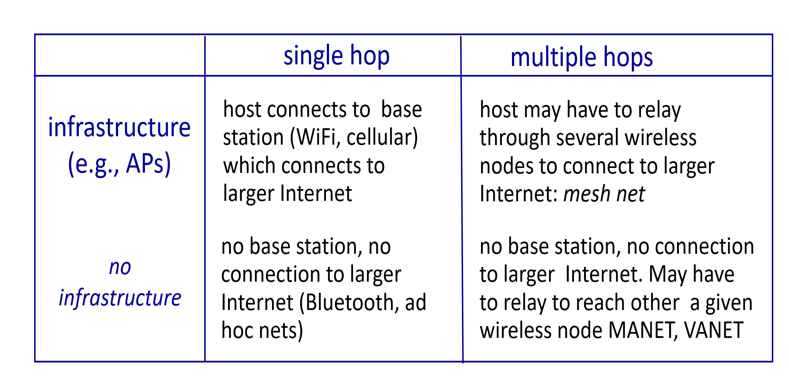

# 第七章-无线网络

## 7.1 概述

无线主机

无线链路

基站（base station）：通常和某个有线网相连接；向与之相关联的无线主机发送数据并从主机那里接受数据；与基站关联的主机通常被称为以**基础设施模式**运行（因为所有的基础网络服务，如地址分配和路由选择都由网络通过基站相连的主机提供）。在**自组织网络**（ad hoc network）中。无线主机没有这样的基础设施与之相连，此时主机本身必须提供如路由选择、地址分配以及类似 dns 的名字转换服务。

基础设施模式：

1. 设备通过基站接入网络
2. handoff/handover（切换）从一个基站切换到另一个基站

ad hoc：

1. 没有基站
2. 结点只能向自己链路范围内的结点传输
3. 这些结点互相之间构成了网络

## 7.2 无线链路和网络特征

有线网络和无线网络的区别

1. 递减的信号强度
2. 来自其它源的干扰：在同一个频段发送信号的电波源互相干扰（无线电话和无线局域网）
3. 多路径传播：电磁波受物体和地面反射，在发送方和接收方之间走了不同长度的路径
4. 如下的比特差错问题（更高可能产生差错）

无线链路不仅采用 crc 错误检测码。还采用了链路层可靠的数据传送协议来重传受损的帧

**信噪比**（signal-to-noise ratio, SNR）是所受到的信号和噪声强度的相对测量（单位分贝），信噪比越大，越容易从噪声中提取出信号

1. 存在隐藏终端问题

A 和 C 之间的信号衰减严重导致检测不到彼此（有障碍物，比如山），但是他们的信号在 B 处又会发生很强的干扰

---

> CDMA（码分多址， code division multiple access）

在 cdma 中，要发送的每一个比特都通过乘以一个信号（编码）的比特来进行编码，这个信号的变化速率（码片速率,chipping rate）比初始数据比特序列速率快得多

编码空间划分：对于每个用户都分配独立的“编码”（编码空间划分）

允许用户使用相同的频率，每个用户都有自己的“码片序列”（编码）来处理数据；可以同时发送数据（若编码是两两正交的）

encoding：内积（原始数据和编码做内积）

decoding：内积后求和（编码数据与编码做内积）

每个编码实际上就是一个标准正交基，所以互作内积结果就是 0 or 1

对于没有干扰的情况：

对于有干扰的情况：

## 7.3 WiFi：802.11 无线局域网

### 7.3.1 无线局域网体系结构

基本构件模块是基本服务集（basic service set, BSS，也称作 cell），包含一个或多个无线站点以及一个被称为接入点（Access point, AP）的中央基站，ap 连接到一个互联设备（交换机或者路由器）进而接入互联网

基础设施模式下的 BSS:

- 无线站点（每个设备上的模块）
- 接入点：基站
- 基础设施=AP+路由器+接入互联网的有线以太网

ad-hoc 下的 BSS：

- 只有无线站点之间的互联

> 信道与关联

802.11定义了11个部分重叠的信道，当且仅当两个信道由 4 个或更多信道个开始它们才没有重叠。

802.11 标准要求每个AP 周期性地发送信标帧，每个信标帧包括该 AP 的 SSID 和 MAC 地址。你的无线站点为了得知正在发送信标帧的 AP, 扫描 11 个信道，找出来自可能位于该区域的AP 所发出的信标帧（其中一些 AP 可能在相同的信道中传输，即这里有一个丛林！）

每一个要接入互联网的站点必须和某一个 AP 相关联

- 扫描信道，监听信标帧
- 选择相关联的 AP
- 可能存在身份验证
- 运行 DHCP 以获取在 AP 子网中的 ip 地址

### 7.3.2 802.11 mac 协议

采用带碰撞避免的载波侦听多路访问（CSMA/CA） 不同于之前学的 CSMA/CD（带有碰撞检测的载波侦听多路访问）

CSMA：当侦听到信道忙碌抑制传输（随机 backoff）

1. 802.11 使用碰撞避免而非碰撞检测（碰撞检测要求站点同时有发送和接收的能力，但是接收很困难；同时由于隐藏终端问题和衰减问题导致无法检测到所有的碰撞）
2. 由于无线信道相对较高的比特差错率，802.11 采用链路层确认/重传（ARQ）方案

故一旦站点开始发送一个帧，就完全地发送整个数据帧

DIFS:分布式帧间间隔 SIFS:短帧间间隔

> RTS（请求发送, request to send）, CTS（允许发送，clear to send）

### 7.3.3 802.11 帧

长度（34～2346 字节）

1. 有效载荷和 crc

    载荷通常<1500字节，可以放置一个 ip 数据报或者一个 arp 分组  

2. 地址字段，每个地址字段都是一个 mac 地址

    

    

    AP 是链路层设备，不能理解 ip 地址，地址3帮助获取了路由器接口的 mac 地址.

3. 序号：区分重传和新传输
